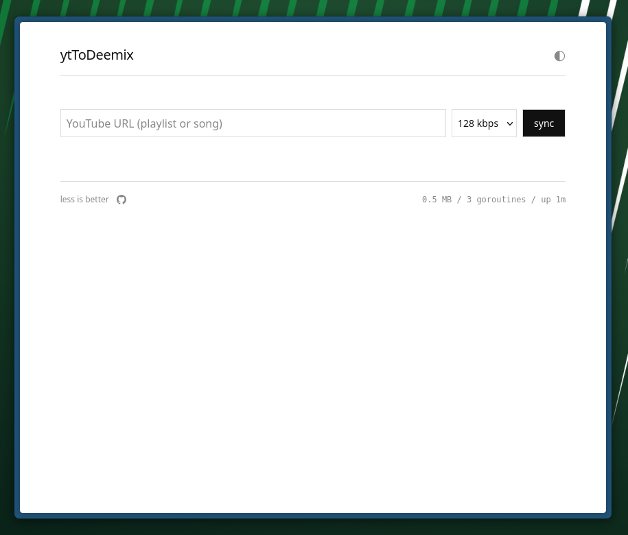

# ytToDeemix

Transfer music from YouTube to a self-hosted Deemix instance. Works with playlists and single songs.

You have a YouTube playlist or a song link. You want those tracks on your server. This bridges the gap: it reads the URL, figures out what each video is, finds the matching track on Deezer, and queues it for download through your existing Deemix setup.

[](LICENSE)
[](go.mod)
[](https://github.com/fabienpiette/yt-to-deemix/tags)



<p align="center">
<a href="https://buymeacoffee.com/fabienpiette" target="_blank"></a>
</p>

## How it works

1. Paste a YouTube URL (playlist or single song)
2. yt-dlp fetches the metadata (no video downloads)
3. Video titles are parsed to extract artist/song (handles most common formats)
4. Each track is searched on Deezer via your Deemix instance
5. (Optional) Tracks already in your Navidrome library are skipped
6. Matches are auto-queued for download at your chosen bitrate

## Requirements

- A running [Deemix](https://gitlab.com/Bockaj/deemix-docker) instance
- A Deezer ARL token (grab from your browser cookies on deezer.com)
- Docker (recommended) or Go 1.24+ and yt-dlp installed locally

## Quick start

```bash
cp .env.example .env
# Edit .env with your DEEMIX_URL and DEEMIX_ARL

docker compose up -d
```

Open `http://localhost:8080` in your browser.

## Deploy with Docker Compose

```yaml
services:
  yttodeemix:
    image: ghcr.io/fabienpiette/yttodeemix:latest
    restart: unless-stopped
    ports:
      - "8080:8080"
    environment:
      - DEEMIX_URL=http://deemix:6595
      - DEEMIX_ARL=your_arl_token_here
      # Optional: Navidrome integration
      # - NAVIDROME_URL=http://navidrome:4533
      # - NAVIDROME_USER=admin
      # - NAVIDROME_PASSWORD=secret
      # - NAVIDROME_MATCH_MODE=substring
```

## Configuration

| Variable | Required | Default | Description |
|----------|----------|---------|-------------|
| `DEEMIX_URL` | yes | `http://localhost:6595` | Your Deemix instance URL |
| `DEEMIX_ARL` | yes | - | Deezer ARL authentication token |
| `PORT` | no | `8080` | Web server port |
| `NAVIDROME_URL` | no | - | Navidrome/Subsonic instance URL |
| `NAVIDROME_USER` | no | - | Navidrome username |
| `NAVIDROME_PASSWORD` | no | - | Navidrome password |
| `NAVIDROME_MATCH_MODE` | no | `substring` | How to match tracks: `substring`, `exact`, or `fuzzy` |

All three `NAVIDROME_*` connection variables must be set to enable the skip-if-exists feature. When enabled, a checkbox appears in the UI to opt in per sync.

## Running locally

```bash
# Install yt-dlp if you don't have it
pip install yt-dlp

# Build and run
make run
```

## Development

```bash
make test           # Run tests with race detector
make test-coverage  # Run tests with coverage report
make fmt            # Check formatting
make build-all      # Cross-compile for all platforms
```

## API

| Method | Path | Description |
|--------|------|-------------|
| POST | `/api/sync` | Start a sync session. Body: `{"url": "...", "bitrate": 1, "check_navidrome": true}` |
| GET | `/api/sync/{id}` | Get session state (tracks, progress) |
| GET | `/api/stats` | Server stats (memory, goroutines, uptime) |
| GET | `/api/navidrome/status` | Navidrome integration status: `{"configured": true/false}` |

Bitrate values: `9` (FLAC), `3` (320 kbps), `1` (128 kbps).

## Navidrome integration

When configured, ytToDeemix can check your Navidrome library before downloading, skipping tracks you already have. It uses the Subsonic API (`search2` endpoint), so it works with any Subsonic-compatible server.

**Match modes:**

| Mode | Behaviour |
|------|-----------|
| `substring` | Title and artist are contained within the Navidrome entry (case-insensitive). Catches variants like "(Remastered)" or "(Official)". |
| `exact` | Title and artist must match exactly (case-insensitive). Strictest — avoids false positives from short titles. |
| `fuzzy` | Levenshtein similarity >= 80%. Tolerates minor typos or missing punctuation while rejecting clearly different tracks. |

## Title parsing

The parser handles common YouTube music title formats:

- `Artist - Song`
- `Artist - Song (Official Video)`
- `Artist - Song [Lyrics]`
- `Artist "Song Title"`
- `Song by Artist`
- Various bracket noise: `[HD]`, `(Audio)`, `[MV]`, `(Visualizer)`, `(Official Lyric Video)`, etc.

When parsing fails, the full cleaned title is used as the search query. Deezer's search is fuzzy enough that this often still works.

## License

AGPL-3.0
